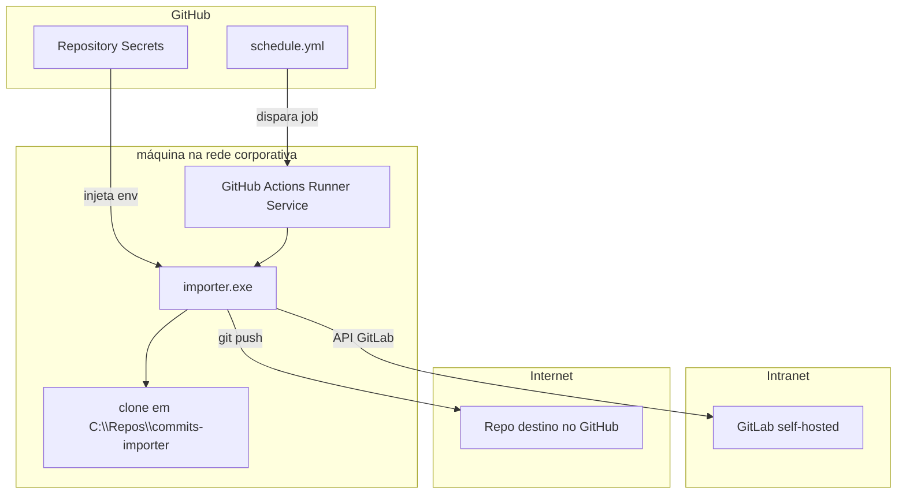

# Self-hosted runner — sincronização diária

Este guia documenta como o **gitlab-activity-importer** roda automaticamente quando o GitLab está em uma **rede corporativa** (intranet) e não é acessível pela nuvem do GitHub.

## Visão geral

O importer busca commits no GitLab e recria no repositório GitHub de destino para refletir atividade no gráfico de contribuições.

Quando o GitLab é **self-hosted / on-premises** e só resolve na rede interna, jobs com `runs-on: ubuntu-latest` **falham** com:

```
lookup git.exemplo.gov.br on 127.0.0.53:53: no such host
```

A solução é um **GitHub Actions self-hosted runner**: um agente instalado na sua máquina (ou servidor interno) que executa o workflow **dentro da rede corporativa**.

## Arquitetura



### Componentes

| Componente | Descrição |
|---|---|
| **Fork do importer** | Repositório no GitHub com o código e o workflow (ex.: `seu-usuario/gitlab-activity-importer`) |
| **Workflow** | [`.github/workflows/schedule.yml`](../.github/workflows/schedule.yml) — cron diário + `workflow_dispatch` |
| **Self-hosted runner** | Serviço Windows que escuta jobs do GitHub |
| **Secrets** | Tokens e URLs injetados pelo GitHub no job (nunca aparecem no log em texto claro) |
| **Repo destino** | Repositório vazio no GitHub onde os commits espelhados são enviados |
| **Clone local** | `C:\Repos\commits-importer` (fixixo no Windows; independente do usuário do serviço). Override opcional: secret/env `COMMITS_IMPORTER_PATH` |

### Workflow atual

O job **deve** usar o runner local:

```yaml
runs-on: self-hosted
```

Comandos no Windows:

```yaml
- run: go build -o importer.exe ./cmd/main.go
- run: .\importer.exe
```

## Runner vs Task Scheduler

| Mecanismo | O que é | Onde ver no Windows |
|---|---|---|
| **GitHub self-hosted runner** | Agente que o GitHub aciona quando há workflow | `services.msc` → serviço `GitHub Actions Runner (...)` |
| **Task Scheduler** | Tarefa agendada nativa do Windows | `taskschd.msc` |

O sync diário **não** usa Task Scheduler. Por isso **não aparece** na lista de tarefas agendadas.

O runner fica em escuta contínua (serviço). Quando o GitHub dispara o workflow (cron ou manual), o job roda na maquina.

## Pré-requisitos na máquina

- **Go** instalado (o workflow usa `actions/setup-go`, mas ter Go no sistema ajuda em execuções manuais)
- **Acesso à rede corporativa** ou VPN no momento do job
- **PC ligado** no horário do cron
- **Serviço do runner** em execução (`Running`) — assim o GitHub mostra o runner como **Idle**
- Pasta **`C:\Repos`** gravável pela conta do serviço do runner (o clone local fica em `C:\Repos\commits-importer`)

```powershell
# Uma vez (como admin): garantir a pasta e permissão de escrita
New-Item -ItemType Directory -Force -Path C:\Repos | Out-Null
# Se o serviço roda como outro usuário, conceda Modify nessa pasta a esse usuário
```

## Manter o runner Idle (serviço Windows)

**Idle** no GitHub = serviço do runner **Running** e online. Não usa Task Scheduler.

1. `Win + R` → `services.msc`
2. Procure `GitHub Actions Runner (...)`
3. Status deve ser **Running**; Startup type **Automatic** (para subir após reboot)
4. Se estiver Stopped: botão direito → **Start**

Ou no PowerShell (admin):

```powershell
Get-Service | Where-Object DisplayName -like '*GitHub Actions Runner*'
# Se parado:
Get-Service | Where-Object DisplayName -like '*GitHub Actions Runner*' | Start-Service
```

No GitHub: **Settings → Actions → Runners** → status verde **Idle**.

## Secrets do GitHub

Configure em: **Settings → Secrets and variables → Actions** no fork.

| Secret | Descrição |
|---|---|
| `BASE_URL` | URL do GitLab (ex.: `https://git.sua-empresa.com.br/`) |
| `GITLAB_TOKEN` | Personal Access Token GitLab (leitura) |
| `GITLAB_USERNAME` | Username GitLab |
| `GH_USERNAME` | Username GitHub |
| `COMMITER_EMAIL` | E-mail verificado no perfil GitHub (grafo de contribuições) |
| `ORIGIN_REPO_URL` | URL HTTPS do repo destino (com `.git`) |
| `ORIGIN_TOKEN` | PAT GitHub com permissão de push no repo destino |
| `COMMITS_IMPORTER_PATH` | *(opcional)* Path do clone local. Padrão no Windows: `C:\Repos\commits-importer` |

**Importante:**

- Secrets são **write-only** — depois de salvar, **não dá para ver o valor** de novo no GitHub
- Guarde uma cópia segura localmente (ex.: gerenciador de senhas), não commite no git
- Ao trocar de PC, **não precisa recriar os secrets** — eles ficam no repositório GitHub

## Tutorial: configurar em um computador novo

### 1. Preparar o repositório no GitHub

1. Faça fork de [gitlab-activity-importer](https://github.com/furmanp/gitlab-activity-importer) para sua conta
2. Crie um repositório **vazio** no GitHub para receber os commits espelhados
3. Configure os secrets listados acima (os 7 obrigatórios; `COMMITS_IMPORTER_PATH` só se quiser outro path)
4. Confirme que o workflow em `.github/workflows/schedule.yml` usa `runs-on: self-hosted`

### 2. Instalar o self-hosted runner (Windows)

1. No fork, abra **Settings → Actions → Runners → New self-hosted runner**
2. Escolha **Windows** e siga as instruções oficiais do GitHub
3. Em um PowerShell **como administrador**, crie a pasta e baixe o runner:

```powershell
mkdir C:\actions-runner
cd C:\actions-runner
# Comandos curl/config do painel "New runner" do GitHub (token de registro expira em pouco tempo)
```

4. Configure o runner (substitua URL e token pelos valores exibidos no GitHub):

```powershell
.\config.cmd --url https://github.com/SEU_USUARIO/gitlab-activity-importer --token SEU_TOKEN_DE_REGISTRO
```

Sugestões durante o `config`:

- Runner group: `Default`
- Runner name: nome da máquina (ex.: hostname corporativo) ou algo descritivo
- Labels: aceite o padrão (`self-hosted`, `Windows`, `X64`)
- Work folder: `_work` (padrão)
- Instalar como serviço: **Y** (sim)

5. Se não instalou como serviço durante o config:

```powershell
.\run.cmd
# ou, para serviço:
.\svc install
.\svc start
```

### 3. Verificar instalação

**Serviço Windows:**

```powershell
Get-Service | Where-Object DisplayName -like '*GitHub Actions Runner*'
```

Deve estar `Running`.

**No GitHub:**

- **Settings → Actions → Runners**
- Runner deve aparecer como **Idle** (verde)

### 4. Testar

1. **Actions → Daily commit sync → Run workflow**
2. Escolha a branch (`main` ou sua branch de feature)
3. No log, confirme que o job rodou **no seu PC**:

| Indicador | Self-hosted (correto) | Nuvem GitHub (errado para GitLab interno) |
|---|---|---|
| Machine name | Nome do seu PC | `GitHub Actions ...` |
| Caminhos | `C:\actions-runner\_work\...` | `/home/runner/work/...` |
| Shell | `cmd` / PowerShell | `/usr/bin/bash` |

4. Log esperado do importer:

```
Found contributions in N projects
Searching commits using N author filters: [...]
Imported X commits.
Successfully pushed commits to remote repository.
```

## Execução manual

Útil para testar na rede corporativa sem depender do runner.

```powershell
cd C:\caminho\para\gitlab-activity-importer

# Carregar .env EXCETO LOCAL_REPO_PATH (senão entra em modo local)
Get-Content .env | ForEach-Object {
  if ($_ -match '^\s*export\s+(\w+)\s*=\s*(.+)$') {
    if ($matches[1] -ne 'LOCAL_REPO_PATH') {
      Set-Item "env:$($matches[1])" $matches[2].Trim()
    }
  }
}

go run .\cmd\main.go
```

Ou compile e execute:

```powershell
go build -o importer.exe .\cmd\main.go
.\importer.exe
```

## Checklist:

- [ ] Remover runner antigo: **Settings → Actions → Runners → Remove** (na máquina antiga ou pelo GitHub)
- [ ] Instalar runner na máquina nova (`C:\actions-runner`, serviço Windows, Startup **Automatic**)
- [ ] Serviço **Running** → runner **Idle** no GitHub
- [ ] Garantir `C:\Repos` gravável pela conta do serviço
- [ ] Secrets **permanecem** no repo — só recriar se tokens expiraram
- [ ] Testar com **Run workflow** (log deve mostrar `Using commits importer path: C:\Repos\commits-importer`)
- [ ] Se precisar resetar estado local: apagar `C:\Repos\commits-importer` (não a pasta do `actions-runner`)
